# Tu primera aventura en Bitcoin

En este curso, te explicaré Bitcoin en 21 capítulos para que puedas entender esta tecnología de manera simple y efectiva. El curso es accesible para todos y explora la industria en su conjunto: mineros, cartera, plataforma de compra/venta, etc.

El curso debería tomar alrededor de 15 horas con un examen final al final. Durante todo el recorrido, hay carteles explicativos sacados de mi libro disponibles, así como recursos adicionales, entrevistas con expertos o videos de preguntas frecuentes. ¡Saldrás de este curso con todo el conocimiento necesario para abordar lo siguiente!

+++

# Introducción: el recorrido de Bitcoin

### Bitcoin: una revolución monetaria y tecnológica descentralizada

Bitcoin es una innovación significativa que va más allá de una simple divisa. Es una revolución tanto tecnológica como monetaria, capaz de transformar nuestra percepción del dinero y de las transacciones financieras. Bitcoin también es una moneda descentralizada, lo que significa que no está bajo el control de ninguna entidad o institución.

### Comprender Bitcoin: moneda, carteras, mineros y futuro

En el marco de este estudio, discutiremos los aspectos monetarios de Bitcoin, incluyendo cómo comprar y vender bitcoins, cómo mantenerlos seguros en carteras digitales y cómo usarlos para realizar transacciones. También examinaremos el papel de los mineros, que son esenciales para la creación de nuevos bitcoins y para la seguridad de la red Bitcoin. Además, nos centraremos en el futuro de Bitcoin y en cómo la tecnología del Lightning Network puede mejorar las transacciones de Bitcoin.

### La importancia de la formación y el aprendizaje

Es esencial comprender que Bitcoin no es solo una moneda, sino también una tecnología que puede revolucionar nuestra percepción del dinero y de las transacciones financieras. Aprender a usar Bitcoin es una habilidad fundamental, al igual que aprendimos a usar Internet o a conducir un automóvil. Debemos recordar que Bitcoin es una tecnología relativamente nueva, y es normal no entender todo de inmediato. Sin embargo, aprender a usar Bitcoin es crucial, ya que puede tener un impacto significativo en nuestra vida financiera.

### Los conceptos clave de la moneda y el papel de Bitcoin

Nuestro próximo tema de estudio se centrará en la definición y el funcionamiento del dinero en una sociedad. También exploraremos el papel de Bitcoin como moneda y cómo puede transformar nuestra percepción de las transacciones financieras.

## 0. La prehistoria de Bitcoin

### Los fundamentos de Bitcoin y el movimiento cypherpunk

Para comprender el origen de Bitcoin, debemos retroceder hasta la década de 1980 y el movimiento cypherpunk. Los cypherpunks son precursores que innovaron y experimentaron con tecnologías como PGP (Pretty Good Privacy), Internet y criptografía. Moldearon un movimiento dedicado a la protección de la privacidad en la era digital. En 2009, una persona (o un grupo de personas) llamada Satoshi Nakamoto desarrolló Bitcoin basándose en las tecnologías desarrolladas por los cypherpunks. Bitcoin representa una revolución en varios niveles: digital, financiero y tecnológico.
Para comprender completamente la naturaleza y el alcance de esta revolución, es crucial entender los fundamentos de Bitcoin

### Bitcoin: una revolución del sistema financiero tradicional

Bitcoin desafía el sistema financiero tradicional al resaltar las desigualdades y los problemas de inflación asociados con la moneda fiduciaria. Las monedas emitidas por los bancos centrales y los estados, como el euro o el dólar, están sujetas a la inflación. Esto puede tener efectos perjudiciales en las sociedades y los individuos. En cambio, Bitcoin, que es una síntesis de tecnologías desarrolladas desde la década de 1970, tiene una cantidad máxima limitada, lo que le confiere una característica similar a la del oro. El debate sobre la validez de Bitcoin como moneda continúa, pero una cosa es segura: gracias al legado de los ciberpunks, Bitcoin está aquí para quedarse.

### Bitcoin: una moneda y un protocolo informático

Bitcoin es tanto una moneda digital como un protocolo informático. Como tal, fue diseñado para perdurar. Es importante reconocer el papel esencial de los contribuyentes y los partidarios de este proyecto, incluidos aquellos que hacen donaciones a través de plataformas como Patreon. En resumen, Bitcoin es una revolución tecnológica, financiera y social que tiene sus raíces en el movimiento ciberpunk. Desafía el sistema financiero tradicional y ofrece una alternativa prometedora y duradera. Para comprender completamente Bitcoin, es esencial entender estos conceptos clave y el legado de aquellos que contribuyeron a su creación.

# Capítulo 1 - ¿Qué es el dinero?

## 1.1 - El dinero

### La evolución del dinero a lo largo de la historia

La evolución del dinero es un aspecto fascinante de la historia humana, reflejando la ingeniosidad de las civilizaciones a través de las edades para satisfacer necesidades económicas en constante evolución. Las primeras formas de dinero eran de naturaleza concreta, a menudo bienes de consumo tangibles como cereales o ganado. Sin embargo, desde hace unos 4000 años, el oro se ha convertido en un estándar universalmente reconocido. El oro cumple idealmente con los criterios de una moneda eficaz: su rareza natural lo convierte en un objeto de valor, mientras que su divisibilidad y transportabilidad lo hacen práctico para el comercio. Además, extraer oro de la tierra requiere una cantidad significativa de energía, lo que refuerza su valor intrínseco. Sin embargo, con el advenimiento de la tecnología y la expansión de la economía mundial, el oro ha sido gradualmente abandonado en favor de soluciones más prácticas, como los billetes y las monedas digitales.

### Los atributos de una moneda eficaz y las formas que puede adoptar

Los criterios de una moneda eficaz son múltiples. Una buena moneda debe ser fungible, es decir, intercambiable sin pérdida de valor; divisible, para facilitar transacciones de diferentes tamaños; y líquida, es decir, fácilmente convertible en bienes o servicios. Históricamente, estos criterios han sido cumplidos por objetos físicos, como el oro. Sin embargo, con el desarrollo de la infraestructura financiera, el oro se ha transformado en billetes de banco, que son más prácticos para el comercio diario. Hoy en día, las monedas siguen evolucionando, adaptando sus formas para satisfacer diferentes funciones. Por ejemplo, mientras que el oro es una excelente reserva de valor, ya no es adecuado para la economía globalizada actual. De igual manera, las monedas fiduciarias como el dólar y el euro son muy líquidas, pero su valor se ve erosionado por la inflación.
Bitcoin, como moneda digital, presenta nuevas posibilidades. Ofrece una excelente reserva de valor y es un buen medio de intercambio, pero aún no se utiliza ampliamente como unidad de cuenta. Debido a la inflación, las monedas fiduciarias como el euro y el dólar no son ideales como reservas de valor a largo plazo.

### Las alternativas a los sistemas monetarios actuales y la importancia de la adaptación tecnológica

Ante los desafíos planteados por los sistemas monetarios actuales, se buscan alternativas para preservar y aumentar el valor del dinero. Los sistemas bancarios recurren a soluciones como transferencias digitales y microtransacciones para satisfacer las necesidades de la economía mundial y adaptarse a los avances tecnológicos.

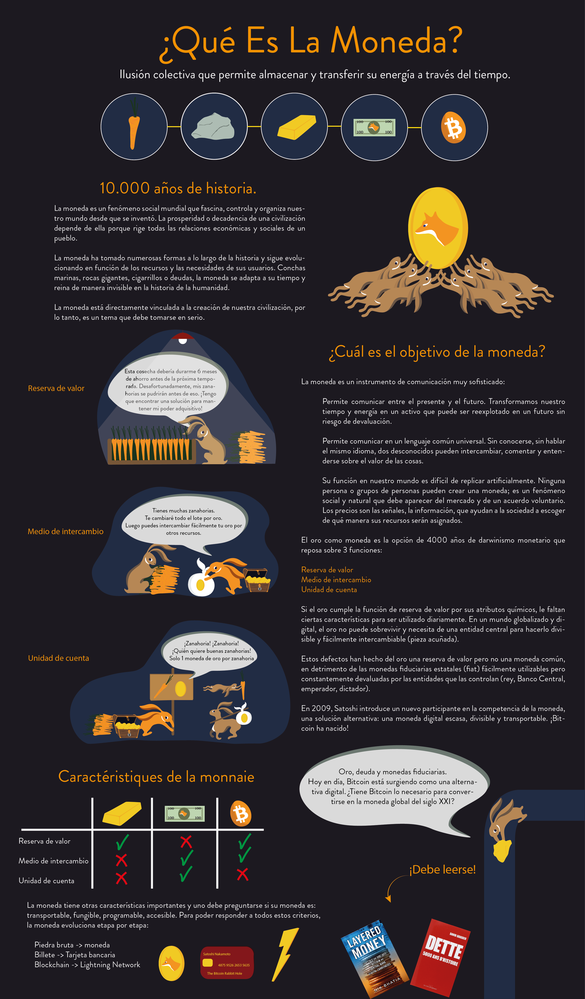

## 1.2 Las monedas fiduciarias

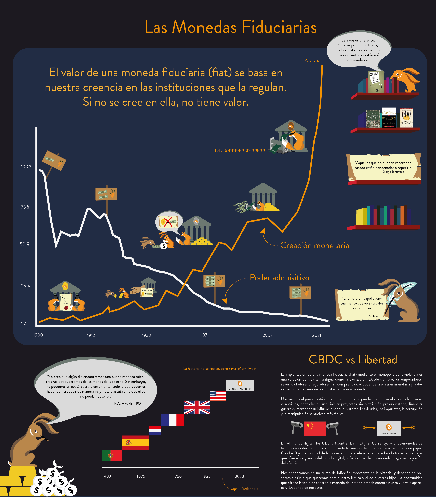

### Las monedas fiduciarias y sus repercusiones en el sistema financiero

Explorar el impacto de las monedas fiduciarias en el sistema financiero es un aspecto esencial de nuestra comprensión de las dinámicas económicas contemporáneas. Parafraseando a George Santayana, "aquellos que no aprenden de la historia están condenados a repetirla". Por lo tanto, abordamos el tema de las monedas fiduciarias desde este enfoque histórico. En el marco de nuestra formación "Descubre Bitcoin", analizamos detalladamente el papel y las consecuencias de las monedas fiduciarias, como el euro o el dólar. Estas monedas se basan en la confianza y la garantía de que su valor se mantendrá. Sin embargo, esta confianza se ve actualmente socavada por la inflación galopante y el aumento sin precedentes de la deuda. Las monedas fiduciarias, en última instancia, dependen de la fe que depositamos en las instituciones que las regulan, y esta fe parece estar disminuyendo.

### La revolución Bitcoin y la disociación entre el Estado y la moneda

Es en este contexto que la revolución Bitcoin está ganando terreno. Esta moneda de confianza tiene como objetivo separar al Estado de la moneda, socavando así el control del Estado sobre el sistema financiero. La capacidad de emitir moneda ha permitido una devaluación gradual de la misma, erosionando el poder adquisitivo de la población. Desde la introducción del euro, el poder adquisitivo ha disminuido en un 30%, mientras que el poder adquisitivo estadounidense ha perdido el 98% de su valor desde 1900. Las monedas fiduciarias ya no tienen un respaldo sólido, ya que el oro ha sido abandonado. La inflación actúa como un impuesto subrepticio que socava el poder adquisitivo. Permite a un Estado devaluar su moneda para pagar su deuda y financiar sus proyectos.

### La moneda de confianza y la impresión de dinero: implicaciones y alternativas

La impresión de dinero genera inflación, empobreciendo gradualmente a la población. Por otro lado, las instituciones financieras y las personas adineradas se han enriquecido gracias a esta práctica, profundizando la brecha de desigualdades y favoreciendo el autoritarismo. Los Estados se ven obligados a mantener su poder devaluando su moneda para facilitar el pago de la deuda. El sistema financiero actual está regulado y restringido para evitar su colapso. Un cambio radical en este sistema podría provocar una crisis económica importante. Los actores políticos carecen de voluntad para realizar un cambio radical, dejando que el sistema siga su curso hasta una eventual implosión.

### Bitcoin: una alternativa descentralizada al sistema monetario actual

En respuesta a estos desafíos sistémicos, Bitcoin se presenta como una solución descentralizada.
Históricamente, el oro ha sido privilegiado como moneda debido a su resistencia a la falsificación. De manera similar, Bitcoin, por su naturaleza descentralizada, no puede ser falsificado y está limitado a 21 millones de unidades. Bitcoin es una moneda basada en la confianza, la transparencia y la libertad, ofreciendo una alternativa atractiva al sistema monetario centralizado actual. Al mismo tiempo, la aparición de monedas digitales de los bancos centrales, o CBDC, parece inevitable. Si bien estas pueden ofrecer una planificación centralizada de la economía, también podrían obstaculizar la libertad financiera y resultar potencialmente autoritarias.

### La hiperinflación, la devaluación de la moneda fiduciaria y la necesidad de alternativas

En conclusión, la hiperinflación tiene el efecto de degradar rápidamente el valor de la moneda, lo que conduce a una erosión del ahorro y una pérdida de confianza en el sistema monetario. Como sugirió Voltaire, una moneda fiduciaria siempre terminará perdiendo su valor intrínseco y convergerá hacia cero. La moneda basada en la confianza, la deuda y la impresión monetaria resulta ser una moneda defectuosa, incapaz de garantizar el poder adquisitivo o preservar el ahorro. Además, los políticos tienen una capacidad ilimitada para imprimir dinero, lo que amenaza el ahorro de los individuos. En respuesta a estos problemas, el proyecto "Descubre Bitcoin" ofrece formación, tutoriales e entrevistas gratuitas en tres idiomas. Su objetivo es ayudar a las personas a comprender el potencial de Bitcoin como una alternativa viable a los sistemas monetarios tradicionales. Gracias por su atención y espero que estas reflexiones le ayuden a navegar por el complejo paisaje financiero de nuestra época.

## 1.3 La hiperinflación

### Hiperinflación en un Sistema Monetario Fiat

Las hiperinflaciones son fenómenos potencialmente devastadores en un sistema monetario fiat, impulsados por decisiones humanas, que pueden llevar a la eliminación del valor monetario. Como resultado, las economías acumuladas pueden desaparecer en un período de tiempo relativamente corto. Hay casos notables de hiperinflación a lo largo de la historia, como Alemania en 1923, Zimbabwe, Venezuela, entre otros. Las monedas fiduciarias, que se crean de la nada, se distinguen de las monedas comunes como el oro. Por ejemplo, con una inflación del 2%, pierde el 2% de su poder adquisitivo anualmente. A un 7%, pierde la mitad en 10 años. A una tasa del 20%, pierde prácticamente todo en menos de 3 años. Por lo tanto, las hiperinflaciones pueden eliminar rápidamente las economías acumuladas. Este fenómeno de hiperinflación no es nuevo y ha persistido a lo largo de la historia. Para entender esta dinámica, es esencial examinar las etapas de la hiperinflación y el proceso de pérdida de confianza en la moneda.

### Hiperinflación y Pérdida de Confianza en la Moneda

La centralización del poder monetario facilita la creación de dinero y la regulación. Sin embargo, la pérdida de confianza en una moneda puede desencadenar una hiperinflación. Los individuos comienzan a cuestionar el origen del dinero y el proceso de creación monetaria. La primera etapa de la hiperinflación es la pérdida de confianza, generalmente debido a factores externos como guerras, medidas sociales o la caída de los precios de un recurso clave.
El segundo estadio es el colapso de la moneda. A medida que los gobiernos pierden el control de la confianza, los individuos comienzan a intercambiar su moneda por otra más estable, como el dólar. Esto provoca un aumento de los precios, creando un círculo vicioso en el que los bienes y servicios se vuelven cada vez más costosos. Para satisfacer estas necesidades, el Estado imprime más moneda, lo que provoca una inflación exponencial mientras el Estado intenta controlar los precios. Cuando la moneda pierde por completo la confianza, la inflación se vuelve astronómica. Entonces se introduce una nueva moneda para reemplazar la antigua, como el dólar. Un ejemplo notable de hiperinflación es Alemania en los años 1920-1923. Para reactivar la economía, se creó una nueva moneda respaldada por la deuda alemana, francesa e inglesa, y garantizada por las tierras alemanas. La resolución de una crisis de hiperinflación a menudo requiere cambios radicales, como revoluciones, cambios de gobierno, cambios de banqueros centrales, entre otros. La pérdida de confianza, el colapso de la moneda y la reconstrucción son fases esenciales para reactivar una nueva economía. Hay varios otros ejemplos de hiperinflación a lo largo de la historia, incluyendo Hungría, Zimbabwe, Francia en 1795 y Chile. Muchas anécdotas ilustran la devaluación de la moneda y la fluctuación del valor de los bienes comunes. Por ejemplo, durante la guerra, los franceses pudieron comprar obras de arte alemanas a bajo precio con francos en Alemania.

### Protegerse de la Hiperinflación y Crear una Cartera Financiera

Conocer la hiperinflación y comprender cómo se produce es una cosa, pero ¿cómo se puede proteger uno contra ella? Para protegerse contra la hiperinflación, se recomienda diversificar su cartera deshaciéndose de las monedas débiles e invirtiendo en activos o monedas sólidas, como el oro o el Bitcoin. Las acciones de empresas capaces de revalorizar sus precios rápidamente, como Apple o Microsoft, o la inversión inmobiliaria también pueden resultar buenas inversiones. Hay mucho que aprender sobre la gestión de una cartera financiera. Afortunadamente, hay muchas formaciones y recursos disponibles para adquirir estas habilidades. Además, no imprimir dinero a voluntad es la mejor manera de prevenir la hiperinflación. El Bitcoin es una moneda que tiene características específicas. Su capacidad para servir para el comercio mundial será discutida en un futuro video.

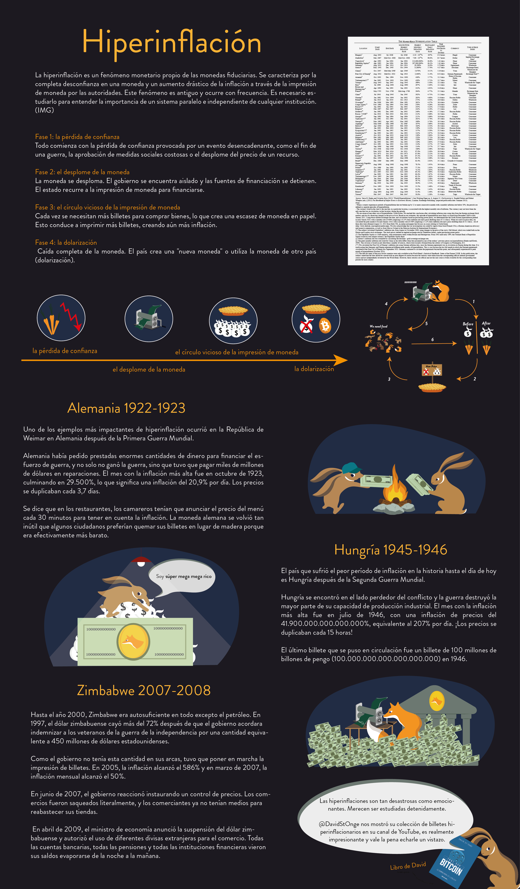

## 1.4 21 millones de bitcoins

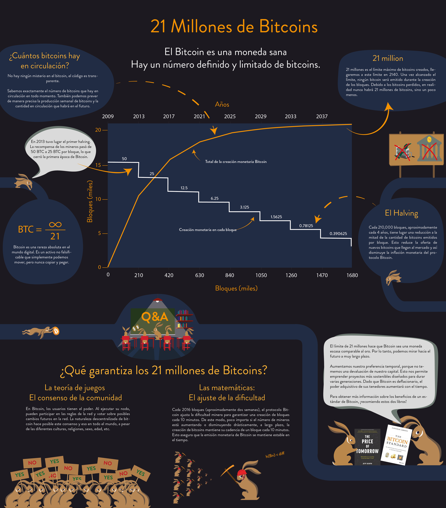

### Emisión Monetaria del Bitcoin

Bitcoin es una moneda digital descentralizada con una cantidad máxima preestablecida de 21 millones de unidades. Esta característica intrínseca de rareza está determinada por su protocolo informático. En cuanto a su emisión monetaria, puede ser ilustrada por una curva que representa la cantidad de bitcoins creados y la frecuencia de su emisión. Por ejemplo, en 2022, alrededor de 18,5 millones de bitcoins estaban en circulación. Las previsiones indican que en 2025 habrá alrededor de 19,5 millones de bitcoins, y en 2037 este número alcanzará los 20,4 millones. La creación de nuevos bitcoins es el resultado del proceso de minería, un procedimiento de validación y ejecución de transacciones en la red Bitcoin. Los mineros, que realizan esta tarea, son recompensados con la emisión de nuevos bitcoins cada diez minutos.
Esta recompensa está programada para disminuir a la mitad cada cuatro años, un evento conocido como "halving". Esto da a la curva de emisión monetaria una forma de escalera. Debido a este mecanismo de halving, se puede predecir matemáticamente que la creación de bitcoins cesará en 2140, cuando el número total de bitcoins alcance su límite de 21 millones.

### La Garantía de Raridad del Bitcoin y Su Protocolo Informático

La rareza del Bitcoin está garantizada por dos mecanismos clave: el límite fijado en 21 millones de bitcoins y el protocolo informático que no puede ser modificado sin el consenso de la mayoría de la red. Dos elementos cruciales más contribuyen a mantener este límite: la teoría del juego y el ajuste de la dificultad de la minería. Los mineros son incentivados a validar las transacciones y a crear nuevos bitcoins cada diez minutos. A medida que el número de bitcoins emitidos se acerca al límite de 21 millones, la red será mantenida por las tarifas de transacción y los bitcoins restantes no minados. El ajuste de la dificultad de la minería se realiza cada dos semanas para garantizar que, en promedio, se añada un nuevo bloque a la cadena de bloques cada diez minutos. Esta frecuencia de creación de bloques y la cantidad total de bitcoins son aspectos fijos del protocolo Bitcoin y no pueden ser modificados sin un consenso general, a diferencia de las decisiones arbitrarias tomadas en los sistemas monetarios tradicionales.

### Verificabilidad y Gestión Sana del Bitcoin

La cantidad fija de bitcoins, inicialmente establecida en 21 millones, no puede ser modificada. Cualquier modificación del protocolo Bitcoin requeriría el acuerdo de toda la comunidad de usuarios, lo cual es altamente improbable. La idea de devaluar la moneda es contraria a la filosofía fundamental del Bitcoin. La rareza del Bitcoin es un gran activo, ya que siempre habrá un máximo de 21 millones de unidades. La cantidad de bitcoins en circulación es pública y verificable por cualquier persona. De hecho, cualquiera puede verificar la cantidad de bitcoins en circulación ingresando un comando simple en un nodo Bitcoin. Esta transparencia y verificabilidad refuerzan la confianza en el sistema Bitcoin, que no se basa en instituciones centralizadas o individuos, sino en una garantía matemática inherente a su protocolo. La noción de una gestión monetaria sana es intrínseca al Bitcoin, ya que es imposible crear más bitcoins que el límite preestablecido o destruir el ahorro de los usuarios. Esta es una característica fundamental que distingue al Bitcoin de otras formas de moneda. Además, según los principios de la economía austriaca, el Bitcoin se considera una excelente forma de moneda. De hecho, su cantidad está estrictamente controlada y emitida de manera predecible, lo que se corresponde con el ideal austriaco de creación monetaria. A diferencia de las monedas tradicionales, que pueden ser susceptibles a la inflación debido a la impresión monetaria excesiva, el Bitcoin mantiene su valor gracias a su rareza programada. En resumen, el Bitcoin, por su naturaleza descentralizada, su rareza programada y su transparencia, ofrece una alternativa única a los sistemas monetarios tradicionales. Ilustra cómo la tecnología puede ser utilizada para crear una moneda que no sólo es útil y verificable, sino que también preserva el valor del ahorro de los usuarios limitando estrictamente su oferta.

## Conclusión Capítulo 1

# Capítulo 2 - Las carteras Bitcoin

## 2.1 Explicación de las carteras Bitcoin

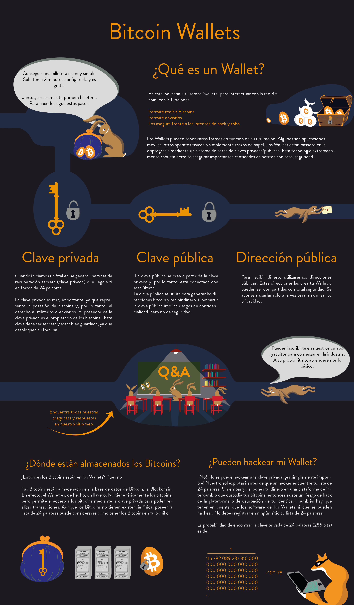

### Las carteras Bitcoin: almacenamiento y seguridad

Bienvenidos a esta presentación sobre las carteras Bitcoin. Vamos a explorar el almacenamiento y la seguridad de los Bitcoins en las carteras. En primer lugar, ¿qué es una cartera Bitcoin? Una cartera es un lugar donde se guardan las claves privadas que dan acceso a tus Bitcoins. Una cartera puede ser un software en tu ordenador, una aplicación en tu smartphone, un dispositivo hardware como una llave USB, o incluso un trozo de papel. Cada cartera contiene un par de claves: una clave pública, que es como una dirección postal, y una clave privada, que es como la llave de tu buzón. La clave pública es la dirección que das a la gente para que te envíen Bitcoins, y la clave privada es lo que te permite gastar los Bitcoins recibidos en esa dirección. El costo de una cartera Bitcoin puede variar según tus necesidades específicas y la cantidad que quieras asegurar. Hay diferentes tipos de carteras adecuados para diferentes usos, ya seas una pequeña o gran empresa, o un particular. Aunque tus claves estén almacenadas en tu cartera, los Bitcoins en sí están almacenados en la blockchain Bitcoin, que es un registro público distribuido en la nube. Es por eso que la pérdida de tu cartera no significa necesariamente la pérdida de tus Bitcoins, siempre y cuando hayas guardado tu clave privada en otro lugar.

### Las claves públicas y privadas en las carteras Bitcoin

Los Bitcoins no están realmente "almacenados" en tu cartera, sino en la blockchain Bitcoin en la nube. Para acceder a tus Bitcoins, necesitas tu clave privada, que suele ser una lista de 24 palabras conocida como "frase de recuperación" o "semilla de recuperación". La probabilidad de adivinar esta frase es extremadamente baja, gracias al poder de la criptografía. Si alguien pudiera romper la criptografía de Bitcoin, podrían romper prácticamente cualquier cosa. Afortunadamente, la seguridad de Bitcoin se puede reforzar si es necesario. De hecho, la probabilidad de adivinar correctamente tu frase de recuperación es aproximadamente la misma que la de encontrar un grano de arena específico entre todos los granos de arena en la Tierra.

### Asegurar tu cuenta Bitcoin: consejos y tutoriales

La probabilidad de que tu cartera Bitcoin sea pirateada es astronómicamente baja si sigues las buenas prácticas de seguridad. Es por eso que es importante seguir los consejos de los expertos en criptografía para asegurar tu cuenta. Elige una cartera que se adapte a tus necesidades y caso de uso. Hay tutoriales detallados sobre el uso y la seguridad de diferentes carteras disponibles en muchos sitios web dedicados a Bitcoin, así como en diversos cursos prácticos sobre Bitcoin.

## 2.2 Elegir tu seguridad

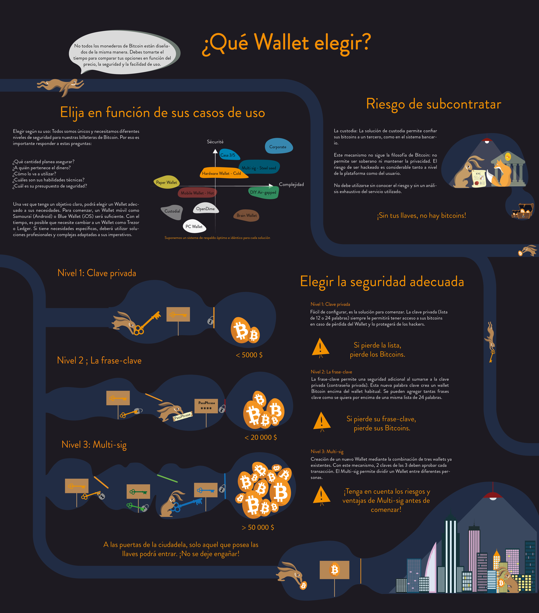

### Las carteras y la seguridad de los fondos

Hola y bienvenidos a esta sesión sobre las carteras y la seguridad de los fondos en el universo de Bitcoin. Cuando tienes Bitcoins, la seguridad de tus fondos es una preocupación importante. La primera pregunta que debes hacerte es a quién pertenecen estos fondos.
¿Se trata de una empresa o de un particular? Las medidas de seguridad necesarias variarán en función de esto. Otro factor importante a considerar es la cantidad de dinero que necesita asegurar y el uso que planea darle. ¿Es una cantidad que utilizará regularmente o es una inversión a largo plazo? Es crucial adaptar las medidas de seguridad a cada situación, ya que no hay una solución universal.

### Diferentes tipos de carteras y niveles de seguridad

Existen varios tipos de carteras para asegurar sus Bitcoins, y la elección dependerá del nivel de seguridad deseado. Los estándares de seguridad varían según los niveles. En el nivel 1, tenemos la clave privada, que desbloquea el acceso a sus fondos. Es una lista de 24 palabras, y se necesita una sola firma para realizar una transacción. Los diferentes tipos de carteras incluyen carteras de hardware, aplicaciones móviles y software de escritorio. Sin embargo, el valor del dinero es subjetivo, por lo que es crucial adaptar la seguridad al nivel de comodidad de cada usuario. En el nivel 2, además de la clave privada, se necesita una frase de contraseña. El nivel 3 es la seguridad multi-firma (Multi-sig), que requiere varias firmas para autorizar una transacción. Este último es ideal para empresas. Los riesgos asociados con las carteras incluyen la pérdida de claves, el robo y el pirateo. La seguridad multi-firma permite limitar estos riesgos y garantizar la seguridad de los fondos.

### Los riesgos del custodio y la importancia de la soberanía financiera

El modelo "custodio" es un sistema tradicional en el que confía sus Bitcoins a un tercero de confianza para asegurar sus ahorros. El problema con este sistema es que pierde los beneficios de la soberanía financiera que Bitcoin ofrece, como la propiedad directa de sus ahorros y la independencia de los bancos. Los riesgos del modelo custodio incluyen confiar su dinero a otra persona y el riesgo de que esta plataforma sea pirateada o quiebre. Los errores humanos suelen ser la causa de los piratas informáticos, no el software utilizado. Se recomienda el uso de una cartera fría, que no está conectada a Internet, para evitar piratas informáticos. Al utilizar servicios de custodia, corremos el riesgo de recrear el sistema financiero tradicional en el que los bancos controlan los ahorros de cada uno y pueden permitirse crear más dinero del que realmente tienen.

### Conclusión

En conclusión, la posesión directa de sus Bitcoins es un elemento esencial para garantizar su soberanía financiera y prepararse para cualquier posible inestabilidad del sistema financiero actual. Se recomienda el uso de una cartera móvil para gastos diarios y una cartera física fuera de línea, o "fría", para almacenar cantidades mayores. Las empresas, por su parte, deberían considerar el uso de sistemas de múltiples firmas, o "multisig", para una mayor seguridad. Es esencial evitar tanto como sea posible los servicios de custodia, que pueden reproducir algunas de las vulnerabilidades del sistema financiero tradicional. Los pasos prácticos para crear y administrar una cartera de Bitcoin se abordarán en nuestra próxima sesión.

## 2.3 Configuración de una cartera

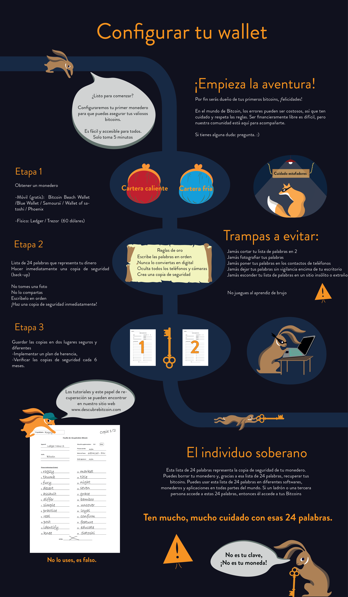

### Reglas básicas para la gestión segura de su cartera de Bitcoin

La seguridad de sus Bitcoins es de vital importancia y un simple error puede tener consecuencias costosas. Es por eso que avanzaremos paso a paso y lo guiaremos con las mejores prácticas de la industria.
Proteja su clave privada

Su clave privada, a menudo representada por una lista de 24 palabras (o "semilla"), es la llave maestra de sus fondos. Si esta clave se revela a un tercero, considere que los fondos asociados ya no están seguros. Por lo tanto, al inicializar su billetera, es importante seguir estas reglas:

- Ocultar todas las cámaras. - No tomar una foto de la lista de palabras. - No ingresarla en una computadora o teléfono. - No guardarla como contacto o enviársela por SMS.

### Registro y respaldo de su clave privada

Literalmente tomará una hoja de papel en blanco o imprimirá este modelo y escribirá con un bolígrafo, de manera clara y legible, la lista de palabras en orden. Si la tinta desaparece con el tiempo, puede perder sus fondos, por lo que existen soluciones alternativas a la tinta tradicional. Si escribe mal, sus herederos pueden no poder leerla y, por lo tanto, no recuperar los fondos. Una vez escritas las palabras, es crucial hacer una copia a mano. Esto permite tener una copia de seguridad en caso de pérdida o accidente.

### Almacenamiento seguro de su clave privada

Una vez realizadas las copias, guarde las listas de palabras en carpetas, en un lugar seguro donde recordará buscarlas. No cree un plan de ocultación demasiado complejo donde pueda perderlas. Sus palabras = su dinero. Las billeteras "frías" generalmente tienen estas listas de palabras, al igual que las billeteras móviles "on-chain". Las billeteras móviles de Lightning Network (LN) pueden tener sistemas diferentes. Solo las malas billeteras que desaconsejamos fuertemente no le darán una lista de 24 palabras, pero quizás le pedirán una cuenta, una dirección de correo electrónico o, peor aún, una identificación. La falta de una lista de 24 palabras debe alertarlo.

## 2.4 Pasar la prueba del tiempo

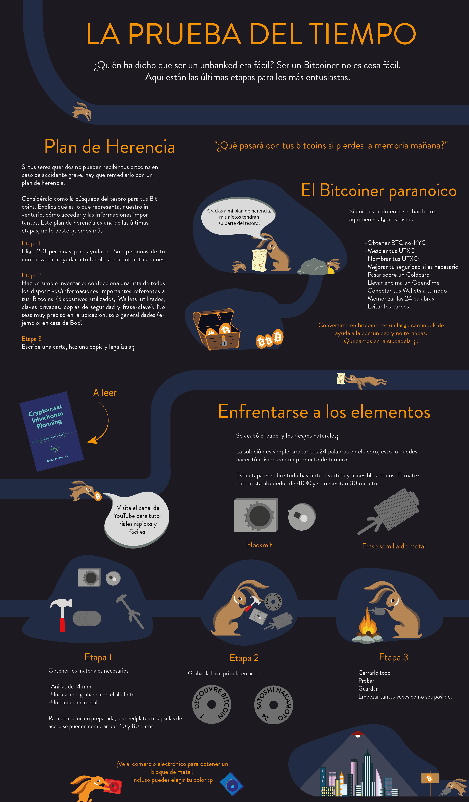

### Seguridad de Bitcoin a largo plazo

La seguridad es una preocupación importante en el ecosistema de Bitcoin. De hecho, como cualquier forma de riqueza, sus bitcoins deben protegerse contra pérdidas, robos y degradación, especialmente a largo plazo. La seguridad de sus bitcoins requiere cierto conocimiento técnico y conciencia de los riesgos asociados, lo que nos lleva a discutir dos estrategias principales: grabar sus bitcoins en acero y crear un plan de herencia.

### Grabar Bitcoins en Acero y Crear un Plan de Herencia

Un método para asegurar sus bitcoins a largo plazo es grabar sus claves de recuperación (por ejemplo, una frase de 24 palabras, conocida como frase semilla) en un material resistente como el acero. Esto crea una copia de seguridad física de sus claves que es resistente tanto a la deterioración física como al fuego.

### Plan de herencia

Junto con esto, la creación de un plan de herencia también es un paso crucial para garantizar que sus activos digitales sean administrados correctamente después de su muerte. Este plan puede incluir una carta escrita a mano detallando sus activos e identificando personas de confianza a contactar. También es crucial discutir la adquisición de bitcoins con un notario para garantizar la conformidad fiscal, aunque es importante nunca confiar directamente sus bitcoins a un tercero, incluido un notario.

**Mira Liana y enlazar a btc 102**

### Privacidad y seguridad al usar Bitcoin

La seguridad de tus bitcoins a largo plazo no se limita a crear copias de seguridad físicas o elaborar un plan de herencia. La privacidad es otra consideración importante. Por ejemplo, es mejor comprar bitcoins sin proporcionar una identificación para minimizar el riesgo de robo de identidad. Además, es esencial utilizar billeteras Bitcoin que se adapten a tus necesidades para garantizar tanto tu anonimato como la seguridad de tus activos. Herramientas de seguridad como tarjetas inteligentes, billeteras de hardware y dispositivos OpenDime pueden contribuir a fortalecer la seguridad de tus bitcoins. También es importante recordar tu frase de recuperación (o "seed phrase"), una práctica conocida como "brain wallet", que garantiza que siempre tengas acceso a tus bitcoins, incluso en caso de pérdida o robo de tu billetera de hardware. En resumen, la seguridad y la privacidad son dos aspectos clave de la posesión de bitcoins a largo plazo. En la siguiente sección, abordaremos en detalle el funcionamiento técnico de Bitcoin. Esperamos que esta información te ayude a navegar de manera segura en el ecosistema de Bitcoin.

# Capítulo 3 - Aspectos técnicos de Bitcoin

## 3.1 Lanzamiento de Bitcoin

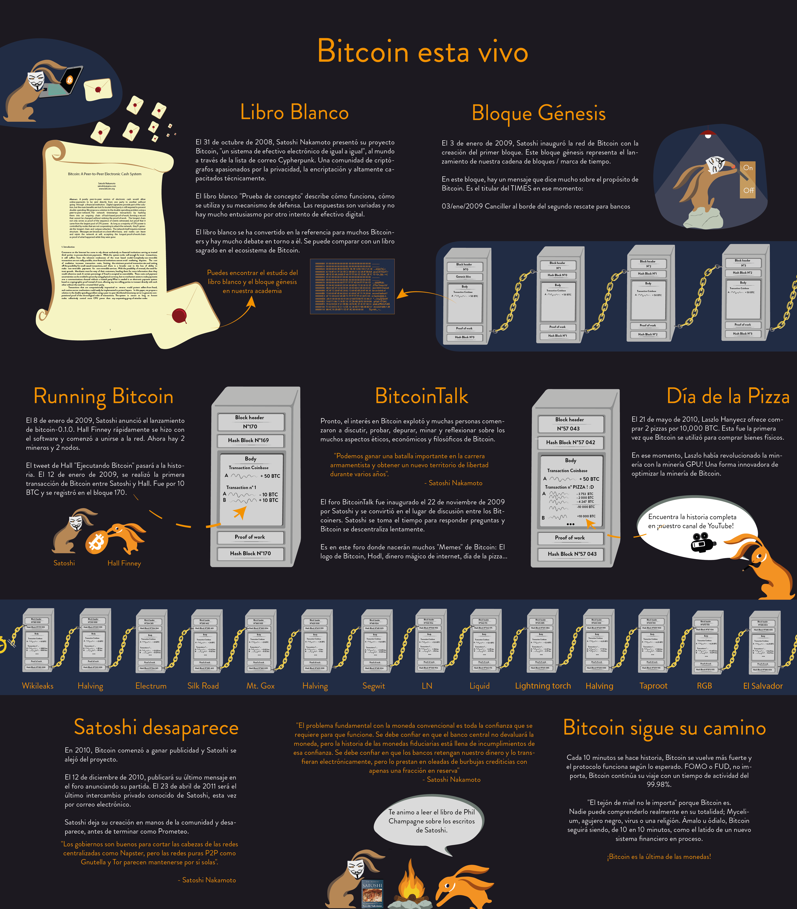

### El surgimiento de Bitcoin

El 31 de octubre de 2008 marca el nacimiento de una nueva tecnología financiera: Bitcoin. En esta fecha, Satoshi Nakamoto, el arquitecto anónimo de Bitcoin, presenta su innovación al mundo a través de una carta distribuida en la lista de correo cypherpunk, una comunidad de criptógrafos apasionados por la privacidad y el cifrado. Esta carta contenía un documento llamado "White Paper", que describe el funcionamiento, uso y sistema de defensa de Bitcoin. Esta iniciativa no generó un entusiasmo inmediato, dada la falla de los sistemas de efectivo digital anteriores. Sin embargo, este White Paper se convirtió en una referencia para los usuarios de Bitcoin y fue objeto de muchos debates en el ecosistema de Bitcoin.

### El primer bloque - El Bloque Génesis

El 3 de enero de 2009 a las 18:15, Satoshi inaugura oficialmente la red de Bitcoin creando el primer bloque, también conocido como bloque génesis, que marca el lanzamiento de la cadena de bloques de Bitcoin. Este bloque contiene un mensaje revelador de la misión de Bitcoin: "03/jan/2009 Chancellor on brink of second bailout for banks" (El canciller al borde de un segundo rescate bancario). El 8 de enero de 2009, Satoshi anuncia la publicación de Bitcoin-0.1.0. Rápidamente, Hal Finney toma el software y se une a la red. Ahora había 2 mineros y 2 nodos en la red. Finney inmortaliza este paso tuiteando "Running Bitcoin". El 12 de enero de 2009, se realiza la primera transacción de Bitcoin entre Satoshi y Hal Finney. Esta transacción, de 10 BTC, se registra en el bloque 170.

### La evolución del diálogo sobre Bitcoin

El interés por Bitcoin crece rápidamente y muchas personas comienzan a probar, debatir, solucionar errores, minar y reflexionar sobre los aspectos éticos, económicos y filosóficos de Bitcoin. Para facilitar estos intercambios, Satoshi crea el foro BitcoinTalk el 22 de noviembre de 2009. Este foro se convierte rápidamente en el lugar de discusión privilegiado para los usuarios de Bitcoin. Es aquí donde nacen muchos memes y símbolos asociados con Bitcoin, como el logo de Bitcoin, Hodl, magic internet money y Pizza day.
El 21 de mayo de 2010, Laszlo Hanyecz hizo historia en Bitcoin al proponer comprar 2 pizzas por 10,000 BTC. Fue la primera vez que Bitcoin se utilizó para comprar bienes materiales. Laszlo también es reconocido por haber revolucionado la minería de Bitcoin gracias a la minería con GPU.

### La desaparición de Satoshi Nakamoto

En 2010, cuando Bitcoin comenzaba a llamar la atención de los medios, Satoshi decidió tomar distancia. El 12 de diciembre de 2010, publicó su último mensaje en el foro, anunciando su partida. El 23 de abril de 2011, realizó su último intercambio privado conocido por correo electrónico. Satoshi desapareció, dejando su creación en manos de la comunidad. A pesar de la ausencia de Satoshi, Bitcoin sigue desarrollándose. Cada 10 minutos, se escribe la historia de Bitcoin y el protocolo sigue funcionando según lo previsto. No importa el miedo, la incertidumbre o la duda (FOMO o FUD), Bitcoin sigue avanzando, con una disponibilidad del 99.98%. Bitcoin es percibido de manera diferente por cada individuo. Para algunos, es una entidad fúngica como el micelio, para otros, es un agujero negro, un virus o incluso una religión. Ya sea que ames u odies a Bitcoin, sigue existiendo, con su ritmo constante de 10 minutos por 10 minutos, como el latido del corazón de un nuevo sistema financiero. Para profundizar en tus conocimientos sobre los escritos de Satoshi Nakamoto, recomiendo el libro de Phil Champagne. Satoshi mismo mencionó: "Los gobiernos son buenos para cortar la cabeza de las redes controladas de manera centralizada como Napster, pero las redes puramente P2P como Gnutella y Tor parecen defenderse".

Bitcoin es una innovación sin precedentes en el mundo financiero. A pesar de los desafíos y controversias, sigue siendo una fuerza impulsora en el mundo de la moneda digital.

## 3.2 Explicación de una transacción

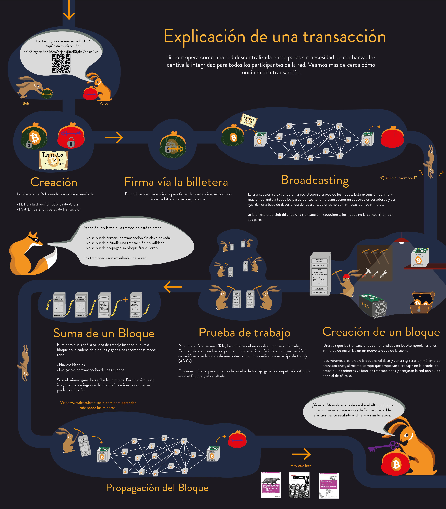

### Transacciones de Bitcoin: el proceso de transferencia de fondos

Una transacción de Bitcoin implica un intercambio de Bitcoins entre dos partes. Tomemos como ejemplo a dos protagonistas, Alice y Bob. Alice quiere adquirir Bitcoins, mientras que Bob ya los tiene. Para que Bob pueda transferir Bitcoins a Alice, ella debe proporcionarle su dirección de Bitcoin, que es esencialmente el destino de recepción para los Bitcoins. Esta dirección, derivada de la clave pública de Alice, es única para su billetera de Bitcoin. Luego, Bob inicia la transacción utilizando la dirección de recepción de Alice. También agrega una tarifa de transacción, que es un incentivo para que los mineros incluyan la transacción en el siguiente bloque. Estas tarifas son esenciales para evitar que la red se inunde con transacciones sin valor. El tamaño de la transacción depende del número de partes involucradas y de la complejidad de la transacción. Para finalizar la transacción, Bob debe firmarla digitalmente con su clave privada, lo que permite verificar que es el propietario de los Bitcoins que desea transferir.

### Papel de los mineros en la validación de transacciones

Los mineros tienen la tarea de tomar las transacciones no confirmadas, verificarlas y compilarlas en un bloque. Para hacer esto, deben resolver un acertijo criptográfico en un proceso llamado "prueba de trabajo". Es un proceso computacionalmente intensivo que requiere una considerable potencia de procesamiento. Esta prueba de trabajo requiere encontrar una solución a una ecuación matemática difícil, un proceso que puede requerir miles de millones de intentos. Después de encontrar una solución, los mineros pueden agregar el bloque a la cadena de bloques y son recompensados por su trabajo con Bitcoins recién creados y las tarifas de transacción.

### Añadir un bloque a la Blockchain y el poder de los usuarios

Después de la validación por los mineros, el bloque se agrega a la blockchain, que es un registro público inmutable de todas las transacciones de Bitcoin. Cada bloque se agrega a la blockchain aproximadamente cada diez minutos. Es esencial tener en cuenta que modificar el historial de la blockchain requeriría una cantidad de potencia de cálculo superior al 51% de toda la red de minería de Bitcoin, lo que es prácticamente imposible. Sin embargo, si un minero malintencionado lograra insertar una transacción fraudulenta en su bloque y resolver la prueba de trabajo, el bloque se agregaría a la blockchain. Sin embargo, sería rechazado por los otros nodos de la red que validan las transacciones refiriéndose a la regla de consenso de la red. En última instancia, el sistema de transacciones de Bitcoin es descentralizado y funciona en pares, sin intermediarios de confianza. Los usuarios transmiten dinero firmando digitalmente las transacciones con sus claves privadas. Los mineros no tienen todo el poder, ya que los usuarios también tienen un control significativo a través de los nodos. Para que la red de Bitcoin sea completamente destruida, sería necesario eliminar todos los mineros, nodos y usuarios, una tarea prácticamente imposible debido a la naturaleza descentralizada de la red.

## 3.3 Los nodos de Bitcoin

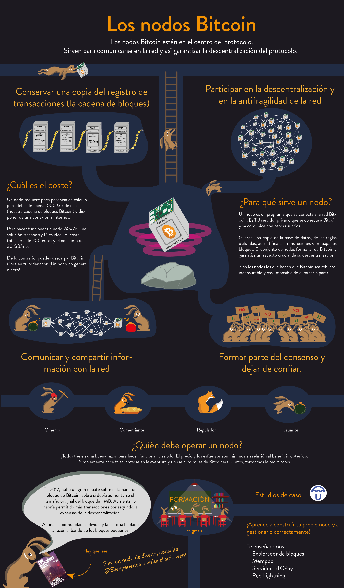

Los nodos son un elemento fundamental de la arquitectura de la red de Bitcoin. Realizan diversas funciones cruciales, como mantener la blockchain, participar en la descentralización de la red, orientar el sistema y validar transacciones.

### Estructura y funcionamiento de los nodos de Bitcoin

La red de Bitcoin está compuesta por todos los nodos conectados. Cada nodo tiene una copia de la blockchain, lo que permite verificar las transacciones y evitar cualquier intento de fraude. El aspecto descentralizado de la red le confiere a Bitcoin una resistencia y robustez excepcionales: para destruirlo, sería necesario eliminar todos los nodos en todo el mundo. Los nodos cumplen tres misiones principales: mantener el historial de la blockchain, transmitir información y verificar la exactitud de las transacciones difundidas. Siguen las reglas de consenso de Bitcoin para validar transacciones y bloques. Estas reglas son simples e invariables. Además, los nodos supervisan las reglas de consenso monetario de Bitcoin para asegurarse de que los mineros cumplan con las directrices de la minería. Los nodos actúan de alguna manera como el sistema legal de la red. Gracias a ellos, todos los participantes de la red siguen las mismas reglas. Para realizar cambios en la red, es necesario obtener la aprobación de todos los nodos. Si la mayoría aprueba un cambio, todos los nodos se actualizan con las nuevas reglas. Los cambios importantes son raros y requieren una coordinación importante entre miles de actores con ideologías variadas. Costos y alojamiento de los nodos de Bitcoin

Una vez que se comprende la importancia de los nodos en la red de Bitcoin, es necesario examinar su costo y opciones de alojamiento. El costo de un nodo depende del tipo de nodo, pero puede ser de alrededor de 200-300 euros para un nodo físico. Los gastos necesarios para hacer funcionar un nodo de Bitcoin incluyen una conexión a Internet de 20 gigas de ancho de banda por mes, que cuesta en promedio 150-200 euros, y alrededor de 5 euros por año para la electricidad. Es posible adquirir cajas específicas para alojar el hardware necesario para administrar un nodo de Bitcoin. Hay dos opciones para alojar un nodo: en casa o a través de un servidor de alojamiento, este último con un costo promedio de 12 euros por mes.
El interés de los nodos en la descentralización de la red Bitcoin es crucial para entender. Existen formaciones dedicadas a los nodos MRL para aquellos que deseen profundizar su comprensión. El costo asequible y la accesibilidad de un nodo Bitcoin, en comparación con otras criptomonedas que requieren infraestructuras más costosas, constituyen una ventaja significativa.

### El poder de los usuarios a través de los nodos: el ejemplo del debate sobre el tamaño de los bloques en 2017

Uno de los principios fundamentales de Bitcoin es el uso de nodos para validar las transacciones y difundir la información a través de la red. Esta estructura garantiza la descentralización del sistema y la independencia financiera de los usuarios. Este enfoque contrasta con otras criptomonedas que no ofrecen a todos la posibilidad de poseer nodos, limitando así su descentralización y su resiliencia. Un punto clave del funcionamiento de Bitcoin reside en el tamaño limitado de sus bloques. Esta restricción limita el número de transacciones que pueden ser procesadas en un tiempo determinado. Si el tamaño de los bloques se aumentara, esto podría llevar a una centralización de la red y elevar las barreras de entrada para los nuevos participantes. Además, si los nodos permanecen fuera del alcance de intervenciones externas, Bitcoin puede resistir eficazmente cualquier forma de censura. El año 2017 estuvo marcado por una intensa controversia, conocida como "la guerra de los bloques". Este conflicto enfrentó a los actores que deseaban modificar Bitcoin aumentando el tamaño de los bloques para aumentar la capacidad de transacción, con aquellos que buscaban preservar la independencia y el poder de los usuarios. Finalmente, los usuarios y los nodos triunfaron al rechazar la propuesta de cambio iniciada por los mineros, las plataformas de intercambio y las instituciones. Después de esta victoria, los nodos activaron el protocolo SegWit, permitiendo mejoras futuras y abriendo el camino para la implementación de la Red Lightning. Esta situación demuestra que los usuarios, gracias a sus nodos, tienen un poder real dentro de Bitcoin, lo que les permite enfrentarse a las grandes instituciones. Los verdaderos perdedores de esta guerra fueron Bitcoin Cash y Bitcoin Satoshi Vision, que perdieron respectivamente el 80% y el 90% de su valor monetario en comparación con Bitcoin, y que son relativamente poco utilizados.

### Conclusión

En resumen, los nodos, ya sean encarnados por dispositivos físicos o software en línea, desempeñan un papel central en el ecosistema de Bitcoin. Conservan el historial de la cadena de bloques, validan las transacciones, difunden la información, mantienen el consenso de la red, votan sobre las futuras mejoras y aseguran la descentralización del sistema.

## 3.4 Los mineros

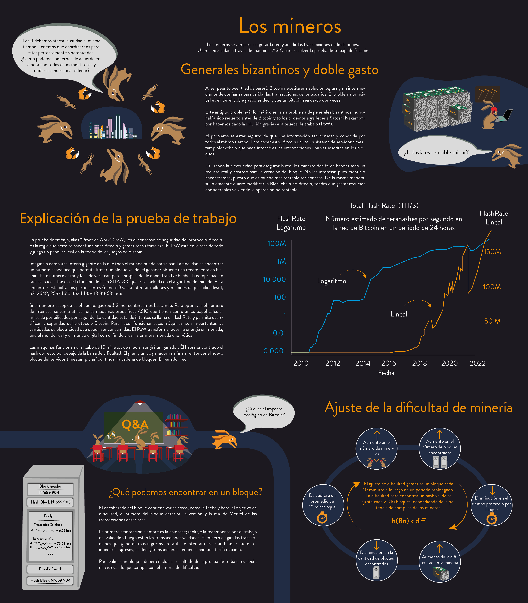

### Los actores clave de la red Bitcoin: Los mineros

Los mineros de Bitcoin son individuos o entidades que dedican electricidad y tiempo a resolver ecuaciones matemáticas complejas para asegurar la red Bitcoin. Juegan un papel crucial en la validación de las transacciones, haciéndolas legítimas a los ojos de todos los usuarios de la red.

### El proceso de minería: algoritmos y dificultades

Los mineros utilizan máquinas ASIC (Circuito Integrado Específico de Aplicación) para resolver el algoritmo de hash SHA256 y validar un bloque de transacciones. Este algoritmo está diseñado de tal manera que es fácil verificar una solución, pero extremadamente difícil encontrarla. Los mineros deben probar cientos de miles de millones de combinaciones antes de encontrar la solución correcta. La dificultad de esta tarea aumenta con el tiempo y el número de mineros participantes.
El ajuste de la dificultad ocurre cada 2016 bloques para mantener un intervalo promedio de diez minutos entre la creación de cada bloque. Cuando nuevos mineros se unen a la red, la tasa total de hash aumenta, lo que reduce el tiempo promedio necesario para encontrar un bloque. Sin embargo, después de aproximadamente dos semanas, la dificultad del algoritmo se aumenta para volver a llevar el tiempo promedio de descubrimiento de bloques a diez minutos.

### El modelo económico de la minería de Bitcoin

El modelo económico de los mineros se basa en las recompensas que reciben por su trabajo. Para maximizar sus posibilidades de éxito, los mineros a menudo colaboran en grupos llamados "pools de minería", donde combinan sus recursos de cálculo. Los mineros recopilan transacciones en bloques candidatos y buscan resolver la ecuación matemática compleja que validará el bloque. En caso de división de la cadena de bloques (fork), dos cadenas concurrentes coexisten hasta que se agrega un nuevo bloque a una de ellas, determinando así la cadena principal.

### La resolución del problema de la doble gasto: Prueba de trabajo y Blockchain

Bitcoin innovó al proponer una solución al problema de la doble gasto gracias al uso de la blockchain. En el mundo digital, la noción de propiedad difiere de la del mundo físico. En internet, todo puede ser copiado y pegado, lo que plantea problemas en términos de doble gasto para los bienes digitales de valor. Se crearon intermediarios de confianza, como los bancos, para resolver este problema tecnológico y garantizar que cuando un bien se transfiere, ya no pertenece al emisor. Entonces surge el problema de los generales bizantinos, un problema de coordinación de información en un sistema descentralizado sin intermediario de confianza. La prueba de trabajo y la blockchain son las soluciones que Bitcoin aporta para resolver este problema. Los "generales" de Bitcoin, o mineros, verifican las transacciones financieras a través de la blockchain para garantizar la autenticidad de la información. El gasto energético asegura la confiabilidad de la información.

### La teoría del juego y la seguridad de la red Bitcoin

Los mineros son los guardianes de la seguridad de la red Bitcoin. Gastan energía para resolver ecuaciones matemáticas complejas. En caso de trampa, perderían dinero y su inversión sería inútil, lo que los disuade de comportarse de manera deshonesta. Incluso en el caso de un ataque del 51%, la red sigue siendo segura porque el atacante debe gastar tanta energía como todos los mineros juntos para intentar modificar la blockchain. Es gracias a este mecanismo de prueba de trabajo, que requiere energía para ser realizado, que la red es segura. La teoría del juego aplicada a Bitcoin descarta a los mineros deshonestos. Los mineros utilizan máquinas ASIC para minar y reciben una recompensa en caso de éxito. Además, a menudo se agrupan en pools de minería para compartir su poder de cálculo y obtener recompensas más rápidamente.

### Conclusión

La minería de Bitcoin es un proceso complejo pero esencial para el funcionamiento y la seguridad de la red Bitcoin. La prueba de trabajo y la blockchain resuelven el problema de la doble gasto y garantizan la veracidad de la información. El gasto energético es necesario para validar el trabajo realizado y garantizar la seguridad de la red. La teoría del juego aplicada a Bitcoin ayuda a prevenir comportamientos deshonestos y mantener la seguridad de la red Bitcoin.

## 3.5 Bitcoin y la ecología

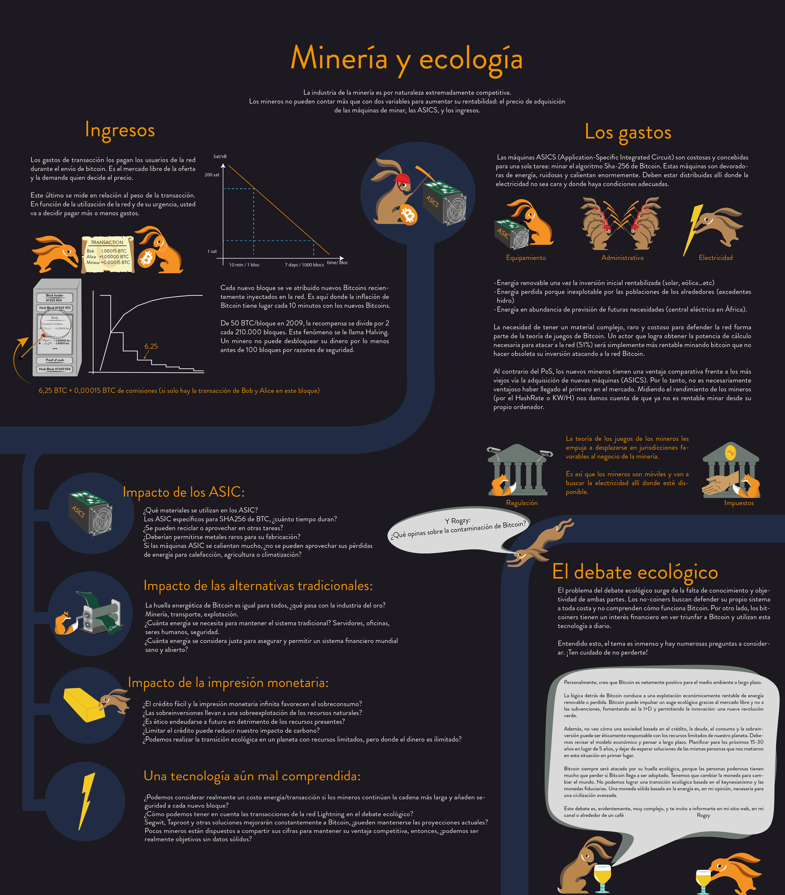

### La importancia de Bitcoin para la libertad financiera y la lucha contra la opresión

Hola a todos.
Hoy hablaremos sobre la importancia de Bitcoin para la libertad financiera y la lucha contra la opresión. Bitcoin, como una invención revolucionaria, ha dado a las personas que viven bajo opresión financiera o bajo un régimen dictatorial un medio para luchar por su libertad. Como último recurso, Bitcoin ofrece una forma de libertad financiera al escapar de la censura y las restricciones bancarias. Bitcoin es más que una simple moneda. Es una forma de comunicación y expresión de la libertad. La energía gastada por los mineros contribuye a la defensa de nuestra libertad. Bitcoin permite la emancipación del sistema financiero actual, dominado por la deuda y la creación monetaria excesiva de los bancos centrales. Para aquellos que viven en países con alta inflación, Bitcoin es una cuestión de supervivencia. Proporciona un medio para sobrevivir en situaciones financieras precarias. Además, Bitcoin ofrece un sistema financiero más justo y equitativo. También brinda la oportunidad a miles de millones de personas en todo el mundo de acceder al sistema financiero.

### El funcionamiento y el impacto ecológico de la minería de Bitcoin

Ahora pasemos al funcionamiento y al impacto ecológico de la minería de Bitcoin. Los mineros de Bitcoin son computadoras especializadas que resuelven acertijos matemáticos para asegurar la red y validar las transacciones. Son recompensados por su trabajo con la creación de nuevos bloques y las transacciones que se encuentran en ellos. Las máquinas ASIC, diseñadas específicamente para minar Bitcoin, son comúnmente utilizadas. A diferencia de las tarjetas gráficas utilizadas para minar otras criptomonedas, los ASIC son más eficientes y tienen una vida útil más larga. Sin embargo, su uso ha generado preocupaciones ambientales. Los mineros son móviles y pueden moverse según las leyes y los impuestos. La electricidad constituye el 90-95% de los costos de operación de los mineros, lo que hace que la fuente, el costo y la sostenibilidad de la electricidad sean particularmente importantes. El riesgo de un ataque del 51% es bajo, ya que es poco probable que un actor único pueda mantener esta mayoría el tiempo suficiente para causar daños importantes. Cuando la producción de bitcoins se detenga, las tarifas de transacción aumentarán en la cadena de bloques principal. Sin embargo, las microtransacciones y las transacciones diarias seguirán siendo procesadas en capas secundarias, como la Red Lightning. El debate sobre el impacto ecológico de Bitcoin a menudo está mal enfocado, principalmente debido a una comprensión insuficiente de su utilidad y funcionamiento. Bitcoin no puede evaluarse simplemente en términos de costo energético por transacción, ya que los mineros aseguran tanto la red actual como la histórica, las transacciones se agrupan y no son todas equivalentes, y el impacto de la Red Lightning no se tiene en cuenta. Aquellos que afirman que Bitcoin consume demasiada energía pueden tener motivaciones políticas o buscar vender su propia solución blockchain. El pretexto ecológico se utiliza para justificar la prohibición de Bitcoin.

### Los desafíos económicos y ambientales de la adopción de Bitcoin

Finalmente, es esencial discutir los desafíos económicos y ambientales de la adopción de Bitcoin. El sistema financiero actual, al fomentar el consumo excesivo y la deuda, plantea graves problemas. La facilidad de acceso al crédito, la emisión monetaria por parte de los bancos y el uso de la reserva fraccionaria son factores que favorecen el endeudamiento. Es necesario reformar el sistema monetario para hacer el dinero y los recursos más escasos. Esto fomentará un consumo más responsable y una visión a largo plazo. La inflación, al fomentar el consumo y la inversión, tiene un impacto negativo en el medio ambiente.
La economía keynesiana actual, a diferencia de la economía austriaca, no tiene en cuenta el aspecto temporal. El dinero ilimitado no puede coexistir con los recursos limitados de nuestro planeta. Los políticos, debido a su visión a corto plazo y su necesidad de crecimiento económico para ser reelegidos, no pueden resolver los problemas ambientales a largo plazo. Adoptar una moneda saludable como Bitcoin podría permitir devolver el poder económico al pueblo. Los mineros de Bitcoin pueden apagar las llamas en los pozos de petróleo que queman metano para evitar la contaminación, lo que es beneficioso para el medio ambiente. Bitcoin fomenta el uso de energía verde. El metano se puede convertir en electricidad para alimentar las máquinas de minería, lo que es beneficioso para todos. La eliminación del petrodólar es necesaria para poner fin a las guerras y al consumo excesivo. El sistema bancario, basado en el petrodólar, fomenta la guerra. Al eliminar el petrodólar, se puede poner fin a las guerras y a la emisión excesiva de moneda. La industria del oro, con sus máquinas contaminantes, tiene un impacto ambiental más importante que la industria de Bitcoin. La tecnología de Bitcoin a menudo se malinterpreta, y las críticas sobre su impacto ambiental a menudo son simplistas. Estas críticas pueden estar motivadas por intereses políticos. Bitcoin tiene el potencial de ayudar en la transición ecológica y contribuir a un mundo más verde. Los medios a menudo difunden ideas falsas sobre Bitcoin y el medio ambiente. Sin Bitcoin, sería más difícil financiar la transición ecológica a través de la creación monetaria.

# Capítulo 4 - Ahorro con Bitcoin

## 4.1 ¡Bitcoin nunca duerme!

### Comprender el precio de Bitcoin y el ahorro saludable

El precio de Bitcoin, al igual que cualquier otra criptomoneda, se caracteriza por una volatilidad significativa. Su valor puede fluctuar considerablemente según las variaciones del mercado. Sin embargo, en comparación con las monedas fiduciarias, Bitcoin tiende a ver aumentar su valor a largo plazo. El ahorro saludable también puede incluir Bitcoin. Una de las estrategias recomendadas es el promedio de costos en dólares, que consiste en invertir regularmente una cantidad fija en Bitcoin, independientemente de su precio actual. Esto permite suavizar el impacto de las fluctuaciones de precios a largo plazo. Además, la estrategia de "hodl" (un término surgido de un error tipográfico que se ha vuelto popular en la comunidad cripto, que significa "hold on for dear life", es decir, "aferrarse a toda costa") anima a conservar los Bitcoins en lugar de intercambiarlos o venderlos. A largo plazo, estas estrategias pueden ser menos arriesgadas y generar mayores rendimientos gracias al efecto de los intereses compuestos.

### La dinámica de Bitcoin: adopción, burbujas especulativas e inversión a largo plazo

Bitcoin, con su cantidad limitada y su proceso de halving, sigue una tendencia general al alza. Al igual que otros activos financieros, Bitcoin está sujeto a ciclos económicos clásicos que incluyen períodos de euforia, burbujas especulativas y correcciones. Este fenómeno es bastante común en las tecnologías emergentes, donde el mercado no siempre es racional o eficiente. El desarrollo y la evolución de Bitcoin están en gran parte relacionados con los diferentes grupos de actores que han integrado gradualmente su ecosistema. Los primeros usuarios de Bitcoin eran principalmente tecnófilos, libertarios y seguidores del oro.
Estos grupos se sintieron atraídos por Bitcoin debido a su capacidad para resolver problemas como la desregulación financiera y la censura. Más tarde, el uso de Bitcoin se extendió a sitios de comercio ilícito en la web oscura, como Silk Road, debido a su naturaleza incontrolable y seudoanónima. La segunda ola de adopción fue ampliamente impulsada por el uso de Bitcoin en Silk Road, un mercado negro en la web oscura. Este sitio llamó la atención sobre la naturaleza no controlable y seudoanónima de Bitcoin, lo que llevó a algunos actores criminales a utilizarlo. Sin embargo, es importante tener en cuenta que el uso de una herramienta, y no la herramienta en sí misma, determina su legalidad o ilegalidad. Es importante señalar que el uso ilegal de Bitcoin no convierte a una persona en un criminal en sí misma. Es el uso, y no la herramienta, lo que puede ser clasificado como ilegal. Por ejemplo, el uso de Bitcoin para actividades como la prostitución es legal o ilegal según la regulación de cada país sobre esta actividad. El año 2017 estuvo marcado por una importante burbuja especulativa en el mundo de las criptomonedas, con el lanzamiento de miles de Ofertas Iniciales de Monedas (ICO). Sin embargo, muchas de estas nuevas criptomonedas no tenían un desarrollo concreto ni utilidad, y desaparecieron rápidamente. El mercado de las criptomonedas experimentó una burbuja en 2017, seguida de un colapso en 2018-2019. Actualmente, el mercado está experimentando otra burbuja especulativa que ha llevado el precio de Bitcoin a 60.000. Esta burbuja se distingue de las anteriores por una mayor diversificación de los inversores, incluyendo instituciones financieras y grandes empresas.

### Un mercado diferente

El mercado de Bitcoin es único en el sentido de que funciona a nivel mundial, las 24 horas del día, los 7 días de la semana, lo que dificulta la regulación por parte de las autoridades financieras. A diferencia de las monedas tradicionales, como el euro, que pueden perder valor, Bitcoin ha mostrado una tendencia al alza debido a su creciente rareza. Sin embargo, la industria de las criptomonedas no está exenta de riesgos, especialmente para los principiantes. Las estafas y los hackeos son frecuentes. Además, hay muchos conceptos y tendencias emergentes que entender, como los NFT (Tokens No Fungibles), que existen desde 2015 pero han ganado popularidad recientemente, el Metaverso, un universo virtual, y la DeFi (Finanzas Descentralizadas), que actualmente se percibe como especulativa. La comprensión y el entusiasmo por el mercado de las criptomonedas son importantes para tomar decisiones informadas.

### Conclusión

En resumen, es importante tener en cuenta que Bitcoin se caracteriza por una volatilidad inherente. Por lo tanto, generalmente se recomienda optar por una estrategia de inversión a largo plazo en lugar de involucrarse en actividades de trading a corto plazo. Aunque el precio de Bitcoin puede sufrir fluctuaciones significativas, tiende a aumentar en promedio en un período de cinco años. Fomentamos un enfoque de ahorro reflexivo que incluya una asignación en Bitcoin, ajustada según su tolerancia al riesgo y sus objetivos financieros. Para aquellos interesados en adquirir Bitcoin, existen diversas formas, incluyendo la compra directa o la adquisición a través del ejercicio de actividades profesionales. El mundo de Bitcoin es rico y constantemente evolucionando, ofreciendo muchas oportunidades de aprendizaje y desarrollo. Se recomienda continuar su educación y mantenerse informado sobre las últimas tendencias y desarrollos en este campo.

### Advertencias

Es importante destacar que esta advertencia no es un consejo financiero.
Bitcoin, al igual que cualquier otra inversión, conlleva riesgos. No gaste más dinero del que pueda permitirse perder. Siempre sea diligente y consulte a un asesor financiero calificado antes de realizar cualquier inversión. El rendimiento pasado no garantiza el rendimiento futuro. La información proporcionada aquí es solo para fines educativos. Cualquier inversión o estrategia de negociación debe basarse en su propia investigación y juicio.

## 4.2 Obtener bitcoins trabajando

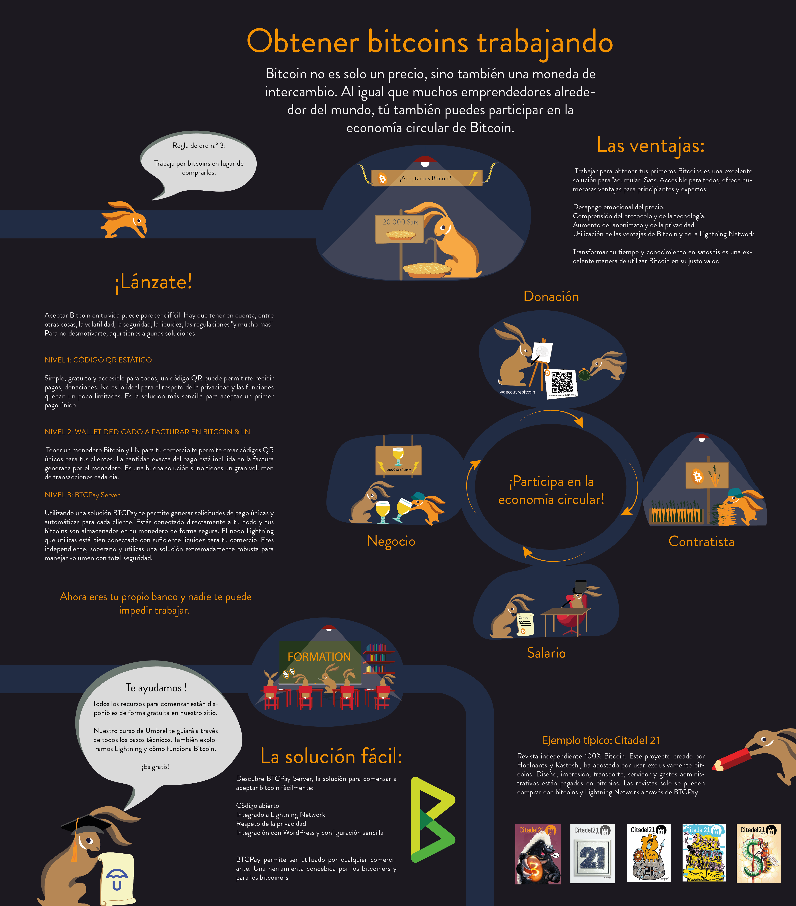

### Adquirir bitcoins trabajando

Bitcoin puede ser visto como una economía paralela a la de las monedas tradicionales. Esto significa que es posible vender bienes o servicios y ser pagado en Bitcoin. Las transacciones pueden realizarse directamente en Bitcoin, sin necesidad de pasar por una plataforma de intercambio. Existen varias formas de aceptar Bitcoin como forma de pago, y estas deben ser estudiadas. Sin embargo, es importante tener en cuenta que el uso de Bitcoin está gravado en Francia, lo que puede disuadir a algunas personas de usarlo como forma de pago. A pesar de esto, es importante destacar que la economía de Bitcoin existe y se está desarrollando en algunas regiones del mundo, como en El Salvador. Además, algunas personas, empresas y organizaciones ya aceptan Bitcoin como forma de pago por sus productos o servicios. Para obtener bitcoins, puede comprarlos en plataformas reguladas por organismos como la AMF (Autorité des Marchés Financiers) en Francia. Este método implica ciertos riesgos y la trazabilidad de sus transacciones. Otra forma de obtener bitcoins es aceptar esta criptomoneda como forma de pago por los productos o servicios que ofrece. Este método le permite adquirir bitcoins a través de su trabajo sin tener que preocuparse constantemente por el precio de Bitcoin. Sin embargo, esto puede resultar difícil ya que muchas personas son reacias a gastar sus bitcoins. **añadir en algún lugar btc map**

### Aceptar Bitcoin para transacciones comerciales: ventajas y soluciones

Aceptar Bitcoin como comerciante tiene varias ventajas, como la falta de censura, tarifas de transacción reducidas, mayor eficiencia, protección contra la inflación, así como libertad y soberanía financiera. Además, la actividad comercial y la economía circular de Bitcoin pueden contribuir a la red de Bitcoin mientras se adquieren bitcoins. Para aceptar Bitcoin, es necesario estudiar las diferentes soluciones disponibles y elegir la que mejor se adapte a su empresa. Se deben tener en cuenta varios factores, como el volumen de transacciones esperado, el presupuesto asignado, el tipo de comercio (en línea o físico), entre otros. Existen tres niveles de aceptación de Bitcoin: el código QR estático, la billetera dedicada a facturas y el uso de la red Lightning. El código QR estático permite recibir pagos en Bitcoin simplemente escaneando un código, mientras que la red Lightning permite transacciones casi instantáneas con tarifas extremadamente bajas. Se pueden utilizar varias herramientas para facilitar la aceptación de Bitcoin, como la billetera Blue Wallet para principiantes o procesadores de pago más avanzados como BTP Server, OpenNode y Galois Bitcoin Beach Wallet para uso más industrial. Cada solución tiene sus ventajas y desventajas, especialmente en términos de anonimato y tarifas.

### Conclusión

El uso de Bitcoin puede ofrecer muchas ventajas, como la eliminación de tarifas de transacción, la reducción del fraude con tarjeta de crédito, la obtención de bitcoins no rastreables, así como una mayor autonomía y flexibilidad.
Aceptar Bitcoin es una práctica cada vez más común en Francia, lo que no solo permite ahorrar en los costos de transacción habituales, sino también atraer a una clientela vanguardista.

## 4.3 Ahorro con Bitcoin

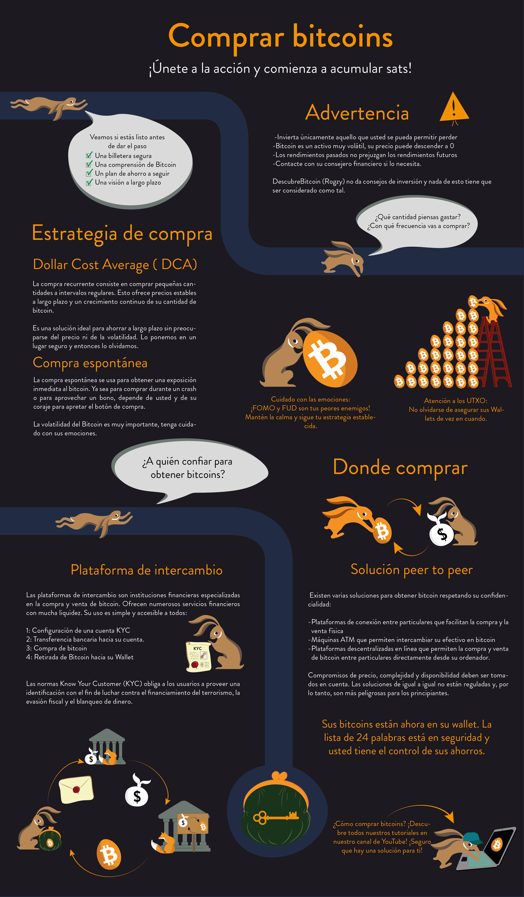

### Introducción a Bitcoin y los riesgos asociados

Bitcoin se ha convertido en un activo financiero importante, principalmente debido a su oferta limitada y su creciente demanda. Sin embargo, la compra de Bitcoin conlleva riesgos que requieren especial atención. Por lo tanto, se recomienda consultar a un asesor de inversión antes de invertir.

### Adquisición y acumulación de Bitcoins

Existen varias formas de adquirir Bitcoins, cada una con sus propias regulaciones. Algunas plataformas requieren una identificación para la verificación, mientras que otras no lo hacen. Es crucial comprender los mecanismos de Bitcoin y las billeteras digitales, así como las regulaciones asociadas con cada plataforma. Un método común de acumulación de Bitcoins es el "Dollar Cost Averaging" (DCA), que consiste en invertir pequeñas cantidades regularmente. Varias plataformas ofrecen este servicio, como Stacking Sat, Relay y PEMIUM. El DCA puede ayudar a suavizar las fluctuaciones de precios a corto plazo y, por lo tanto, se considera una estrategia de inversión viable para la mayoría de las personas. Para inversiones a gran escala, se recomiendan plataformas reguladas y reconocidas como Kraken, Bitstamp y Paymium. Estas plataformas ofrecen un entorno seguro y protegido para transacciones de grandes volúmenes. Retiro y uso de Bitcoins, aspectos legales y futuro hipotético

Después de la compra, se recomienda retirar inmediatamente los Bitcoins de las plataformas de intercambio para minimizar los riesgos de piratería y bloqueo de fondos. Las tarifas de retiro pueden ser altas, a veces hasta 25 euros según la plataforma, por lo que se recomienda proceder por etapas para garantizar la seguridad de las transacciones. El uso de plataformas reguladas es esencial para evitar acusaciones de lavado de dinero, financiamiento del terrorismo o evasión fiscal. Es importante tener en cuenta que, aunque el sistema KYC (Conozca a su cliente) a menudo es criticado, desempeña un papel crucial en la prevención de estas actividades ilícitas. Las transacciones de Bitcoin son rastreables, lo que puede potencialmente afectar la privacidad de los usuarios. Un sistema de direcciones verdes y rojas, posible gracias al KYC, teóricamente podría obstaculizar a Bitcoin, pero es poco probable que esto suceda debido a la naturaleza descentralizada y peer-to-peer de Bitcoin. La compra de Bitcoins se puede hacer a través de cajeros automáticos de Bitcoin (ATM), aunque estos son raros en Francia. El número de estos cajeros automáticos está aumentando constantemente en todo el mundo. Existen diversas opciones para la compra y venta de Bitcoins, incluyendo transacciones directas entre individuos, plataformas de intercambio en línea y cajeros automáticos de Bitcoin. Es importante tener en cuenta que generalmente hay una prima para las transacciones no KYC. También es importante tener en cuenta que hay impuestos a pagar sobre la reventa de Bitcoins, aproximadamente el 30% en Francia. Hay una sección legal en el sitio web con abogados para obtener más información.

## 4.4 Hiper-bitcoinización

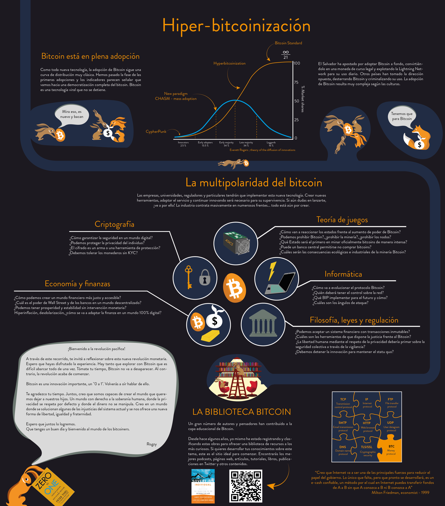

### Adopción y difusión global de Bitcoin

Como cualquier nueva tecnología, la adopción de Bitcoin sigue una curva de distribución muy clásica. Hemos superado la época de los primeros adoptantes y los indicadores parecen apuntar hacia una democratización completa de Bitcoin. Es una tecnología viral que no se detiene.
El Salvador ha tomado la audaz decisión de adoptar el Bitcoin como moneda de curso legal y utilizar la red Lightning para su uso diario. Sin embargo, cada país reacciona de manera diferente ante esta tecnología. Algunos lo han prohibido y criminalizado su uso, lo que añade complejidad a la adopción de Bitcoin según las culturas, épocas y naciones.

### La multipolaridad de Bitcoin y la aparición de nuevas preguntas

El aumento de Bitcoin obliga a empresas, universidades, reguladores y particulares a tener en cuenta esta nueva tecnología. Se deben crear nuevas herramientas, adaptar servicios y continuar innovando para garantizar su supervivencia. Este contexto plantea muchas preguntas en diversos ámbitos, como la criptografía, la teoría de juegos, la economía y las finanzas, la informática, la filosofía, las leyes y la regulación.

### Los futuros desafíos de Bitcoin y el papel de cada uno en esta revolución

Los invito a reflexionar sobre esta nueva revolución monetaria. Hay tantas cosas por explorar con Bitcoin que es difícil asimilar todo de una sola vez. Tómense su tiempo, Bitcoin no va a desaparecer. Al contrario, la revolución acaba de comenzar. Juntos, creo que somos capaces de crear el mundo que queremos dejar a nuestros hijos. Un mundo en el que la soberanía humana es un derecho, la privacidad se respeta por defecto y la moneda no se manipula. Espero que juntos lo logremos.

### La biblioteca Bitcoin

Si desea ampliar sus conocimientos sobre Bitcoin, muchos autores, pensadores y ensayistas han contribuido a la capa educativa de Bitcoin. Desde hace algunos años, he recopilado y clasificado estas obras para ofrecer una biblioteca de recursos a los más curiosos entre ustedes. Encontrarán los mejores podcasts, sitios web, artículos, tutoriales, libros, publicaciones de Twitter y otros contenidos. Milton Friedman, un economista renombrado, predijo en 1999: "Creo que Internet será una de las principales fuerzas para reducir el papel del gobierno. Lo único que falta, pero que pronto se desarrollará, es un dinero electrónico confiable, un método mediante el cual en Internet se puedan transferir fondos de A a B sin que A conozca a B o B conozca a A". Hoy, Bitcoin responde a esta predicción.

## Apóyanos

**texto a añadir**

## Califica la formación

**texto a añadir**

# Capítulo 5 - La red Lightning

## 5.1 Introducción a la red Lightning

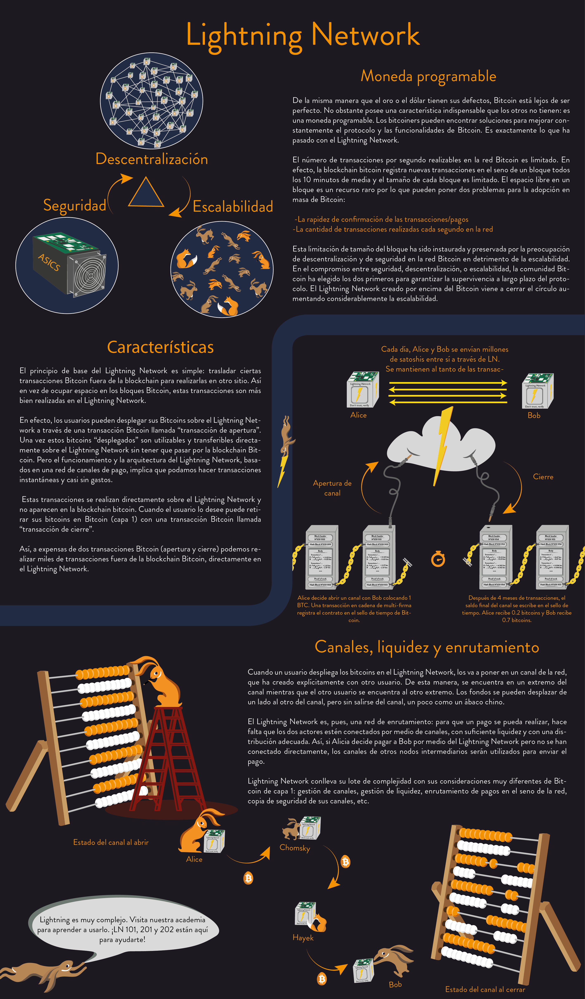

### La red Lightning: una respuesta a la escalabilidad de Bitcoin

La red Lightning es una tecnología revolucionaria que ha cambiado profundamente nuestra percepción de Bitcoin. Es una solución que responde a la pregunta de la escalabilidad de Bitcoin.

### Funcionamiento y ventajas de la red Lightning

Para entender bien la red Lightning, es crucial comprender cómo evoluciona Bitcoin. Bitcoin se desarrolla en capas de infraestructura: la primera capa es la cadena de bloques, y la segunda capa es la red Lightning. Oficialmente reconocida como una capa de Bitcoin, la red Lightning ha sido validada y adoptada a gran escala desde 2021. Permite realizar microtransacciones instantáneas y de bajo costo, resolviendo así el problema de escalabilidad de Bitcoin. La red Lightning funciona gracias a canales de liquidez. La liquidez se transmite de derecha a izquierda y viceversa según las necesidades. Las transacciones están bloqueadas mediante un sistema de firmas múltiples (multisig) y están regidas por nuevas reglas, leyes, formas y flexibilidades.

### Uso práctico e impacto en el futuro de las finanzas

La red Lightning actúa como una red de canales de pago, permitiendo transacciones instantáneas y sin comisiones entre las dos partes.
Este sistema de canales de pago hace posible las transacciones entre individuos que no tienen un canal conectado directamente. Los usuarios de la Red Lightning pueden pagar una tarifa de apertura de canal para crear un contrato inteligente multisig. No hay tarifas de transacción entre usuarios conectados directamente, pero se pagan tarifas a los nodos de enrutamiento Lightning (hubs) para las transacciones entre usuarios no conectados. Los servicios de transferencia de dinero tradicionales, como Western Union, los bancos centrales, Visa y Mastercard, podrían desaparecer si no adoptan la tecnología Lightning Network. El Lightning Network es más eficiente, más barato y más ético que el sistema financiero tradicional. De hecho, el Lightning Network permite realizar millones y miles de millones de transacciones entre dos personas conectadas sin costo y sin gastos energéticos en la cadena de bloques base. Las transacciones están aseguradas por la tecnología criptográfica e indirectamente por la energía de los mineros y la cadena de bloques base. Las transacciones se pueden realizar al instante, sin límite geográfico, y las tarifas son extremadamente bajas. El Salvador es un ejemplo de un país que utiliza principalmente la Red Lightning. Empresas emergentes como Strike aprovechan esta tecnología para enviar euros y dólares en un segundo y sin costo.

### Conclusión

El Lightning Network es el futuro de Bitcoin. Las decisiones de ingeniería para Bitcoin se consideran minuciosamente, tratando a Bitcoin como código nuclear o espacial. La pérdida de Bitcoin sería una pérdida de posibilidad de liberación financiera. El Lightning Network es una nueva capa de infraestructura para resolver el problema de la escalabilidad de Bitcoin. Permite realizar millones y miles de millones de transacciones entre dos personas conectadas sin costo y sin gastos energéticos en la cadena de bloques base. Es esencial mantenerse informado sobre esta tecnología para comprender el futuro de Bitcoin y las finanzas en general.

## 5.2 Casos de uso de Lightning Network

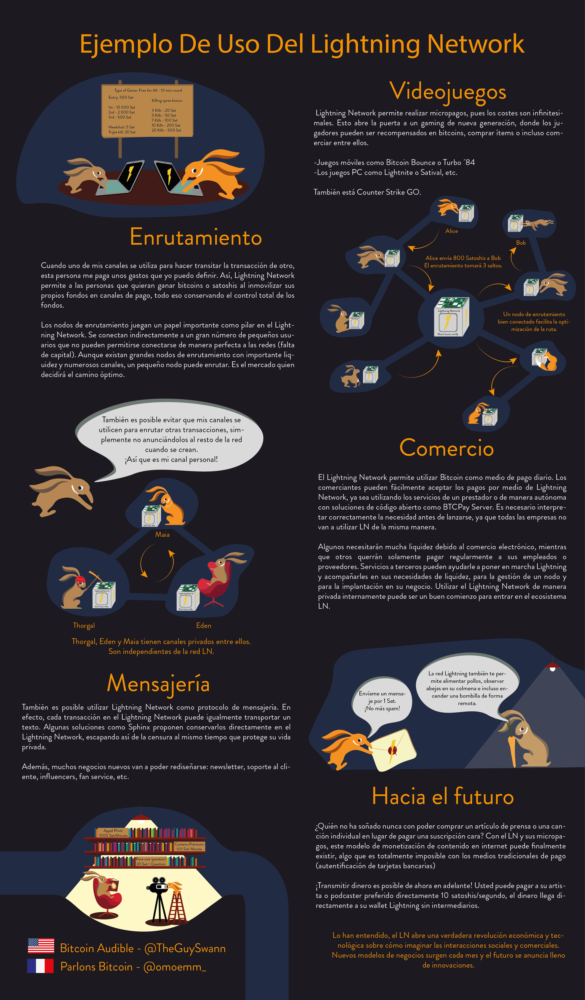

### Microtransacciones en la Red Lightning: una perspectiva crítica

El protocolo Bitcoin, aunque revolucionario, ha enfrentado importantes desafíos en cuanto a escalabilidad y eficiencia de transacciones. Para resolver estos problemas, se propuso e implementó una solución de segunda capa conocida como Red Lightning. Esta tecnología tiene como objetivo facilitar las microtransacciones, es decir, transacciones de muy bajo valor que de otra manera serían impracticables debido a las altas tarifas y los largos tiempos de confirmación en la cadena de bloques de Bitcoin. La Red Lightning funciona creando canales de pago fuera de la cadena entre las partes que desean realizar transacciones frecuentes. Estos canales permiten transacciones casi instantáneas y tarifas mínimas, lo que hace viables las microtransacciones. Esta tecnología abre la puerta a una amplia gama de posibles aplicaciones para Bitcoin, que antes estaban fuera de alcance debido a las limitaciones inherentes a la tecnología de la cadena de bloques. Entre estas aplicaciones se encuentran los nodos de enrutamiento para la eficiencia de la red, la transmisión de dinero para pagos en tiempo real, la mensajería para comunicaciones seguras y descentralizadas, y modelos comerciales futuristas que antes eran inimaginables.

### El impacto de la Red Lightning en la industria de los videojuegos

La industria de los videojuegos ofrece un ejemplo particularmente interesante de cómo la Red Lightning puede utilizarse para transformar los modelos comerciales existentes. El concepto de "skin in the game" es una idea que ha ganado popularidad recientemente en este contexto. Básicamente, se trata de tener una apuesta financiera en el resultado de un juego. La Red Lightning permite a los jugadores apostar pequeñas cantidades de dinero cuando juegan juegos, como 0,001 centavo.
Esto da lugar a sistemas de juegos de video monetarios, donde la competencia no es solo por diversión, sino también por una ganancia financiera real. Los juegos pueden tener tarifas, con tarifas de entrada que van desde 1 centavo hasta 10 euros. Esto agrega un elemento de competitividad que hace que el juego sea más interesante y atractivo. Además, las empresas pueden patrocinar juegos por pequeñas cantidades, creando nuevas oportunidades para los jugadores en regiones como África, donde el potencial de ganancia puede tener un impacto significativo. En resumen, el futuro de las microtransacciones con Bitcoin parece prometedor gracias a innovaciones como Lightning Network. A medida que estas tecnologías continúan desarrollándose y madurando, podemos esperar ver nuevas y emocionantes aplicaciones surgir en un futuro cercano.

### Hacia el futuro: el streaming de dinero y la reinvención de los modelos económicos

El concepto de "streaming de dinero" es una visión para el futuro que es posible gracias a Lightning Network. Esta red permite microtransacciones instantáneas, abriendo el camino a modelos económicos donde los consumidores pagan por segundo por el contenido que consumen. En un sistema así, el dinero se divide automáticamente, según un porcentaje predefinido, entre los diferentes contribuyentes a un servicio o producto. Esto podría revolucionar la forma en que concebimos los modelos de pago. Por ejemplo, en lugar de pagar una suscripción mensual a un servicio, los usuarios podrían ser facturados por segundo por el tiempo que pasan usando el servicio. Este modelo económico podría tener implicaciones profundas para los creadores de contenido, que estarían incentivados a producir contenido de calidad para retener la atención de los usuarios. Los usuarios, a su vez, solo pagarían por el contenido que consumen, eliminando las tarifas de suscripción anticipadas. Incluso es posible utilizar este sistema para pagar por servicios como adelantar un automóvil en la carretera. Aunque este sistema puede parecer injusto para algunos, es importante considerar las ventajas. Las microtransacciones posibles gracias a Bitcoin permiten pagos instantáneos sin intermediarios. Por lo tanto, los automóviles podrían potencialmente realizar pagos entre sí para facilitar el adelantamiento, gracias al uso de una moneda programable. En conclusión, Lightning Network abre una multitud de casos de uso emocionantes para los usuarios de Bitcoin. Los modelos económicos y las oportunidades comerciales que surgen son numerosos y variados. Es importante recordar que hay recursos educativos, como cursos, tutoriales e entrevistas, disponibles de forma gratuita en tres idiomas en DécouvreBitcoin. Para mantenerse al día con las últimas noticias de Bitcoin, no dude en seguir nuestras redes sociales y visitar nuestro sitio web www.découvrebitcoin.com. Agradecemos su atención y compromiso con el aprendizaje y la exploración de esta tecnología revolucionaria.

## 5.3 La píldora roja

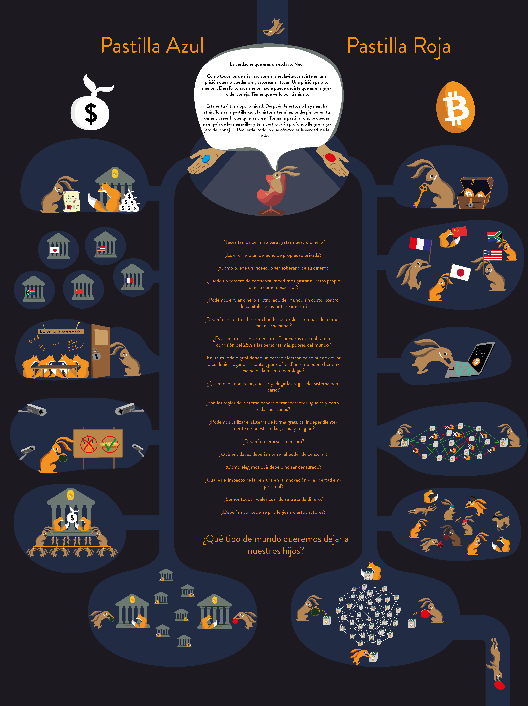

**falta el curso**

# Conclusión general del curso

# Seguir adelante

**texto para destacar otros cursos**

# Agradecimiento y crédito

Este curso se centra en la teoría y la práctica de Bitcoin. Fue diseñado gracias a la contribución de muchas personas dedicadas, incluyendo a Muriel por la creación de los visuales, Ishani, Sarah, Rachel por su valiosa ayuda, así como a Joss y John de Stacking Sat, y toda la comunidad de hodlers en Twitter, YouTube y Discord.
